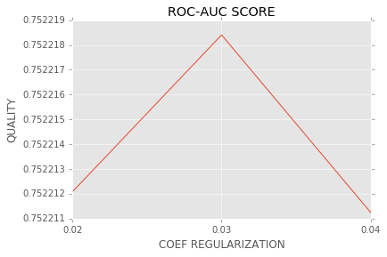

>Бобров Евгений


```python
import numpy as np
import pandas as pd
import matplotlib.pyplot as plt
from sklearn.linear_model import LogisticRegression
from sklearn.cross_validation import train_test_split
from sklearn.preprocessing import StandardScaler
from sklearn.preprocessing import OneHotEncoder
from sklearn import metrics
from sklearn.cross_validation import cross_val_score
plt.style.use('ggplot')
%matplotlib inline
```

# Генерация и селекция признаков.

## Подготовка данных.

>Рассмотрим исходные данные. Удалим из матрицы поля, соответствующие тестовой выборке, а также поля принадлежности героев команд к событию "первой крови" (много пропущенных данных, причём признак категориальный - не ясно как заполнять), они не будут использоваться в дальнейшем. Выделим из таблицы вектор ответов.

>Интересно, что кажущийся на первый взгляд бесполезным признак времени начала матча 'start_time' положительно влияет на качество классификации, и его не стоит отбрасывать. Это можно объяснить тем, что в за весь период сбора данных к игре выходили обновления, и поэтому некоторые вещи и герои начинали вносить иные вклады в игру. Хорошо быть специалистом в предметной области!


```python
data_train = pd.read_csv('features.csv', index_col='match_id')
y = np.array(data_train['radiant_win'])
X = data_train.drop(['first_blood_player1', 'first_blood_player2',
                     'duration', 'radiant_win', 'tower_status_radiant',
                     'tower_status_dire','barracks_status_radiant',
                     'barracks_status_dire'], axis=1)
X.keys()
```


    Index(['start_time', 'lobby_type', 'r1_hero', 'r1_level', 'r1_xp', 'r1_gold',
           'r1_lh', 'r1_kills', 'r1_deaths', 'r1_items', 'r2_hero', 'r2_level',
           'r2_xp', 'r2_gold', 'r2_lh', 'r2_kills', 'r2_deaths', 'r2_items',
           'r3_hero', 'r3_level', 'r3_xp', 'r3_gold', 'r3_lh', 'r3_kills',
           'r3_deaths', 'r3_items', 'r4_hero', 'r4_level', 'r4_xp', 'r4_gold',
           'r4_lh', 'r4_kills', 'r4_deaths', 'r4_items', 'r5_hero', 'r5_level',
           'r5_xp', 'r5_gold', 'r5_lh', 'r5_kills', 'r5_deaths', 'r5_items',
           'd1_hero', 'd1_level', 'd1_xp', 'd1_gold', 'd1_lh', 'd1_kills',
           'd1_deaths', 'd1_items', 'd2_hero', 'd2_level', 'd2_xp', 'd2_gold',
           'd2_lh', 'd2_kills', 'd2_deaths', 'd2_items', 'd3_hero', 'd3_level',
           'd3_xp', 'd3_gold', 'd3_lh', 'd3_kills', 'd3_deaths', 'd3_items',
           'd4_hero', 'd4_level', 'd4_xp', 'd4_gold', 'd4_lh', 'd4_kills',
           'd4_deaths', 'd4_items', 'd5_hero', 'd5_level', 'd5_xp', 'd5_gold',
           'd5_lh', 'd5_kills', 'd5_deaths', 'd5_items', 'first_blood_time',
           'first_blood_team', 'radiant_bottle_time', 'radiant_courier_time',
           'radiant_flying_courier_time', 'radiant_tpscroll_count',
           'radiant_boots_count', 'radiant_ward_observer_count',
           'radiant_ward_sentry_count', 'radiant_first_ward_time',
           'dire_bottle_time', 'dire_courier_time', 'dire_flying_courier_time',
           'dire_tpscroll_count', 'dire_boots_count', 'dire_ward_observer_count',
           'dire_ward_sentry_count', 'dire_first_ward_time'],
          dtype='object')


## Обработка пропущенных значений.

>Начнём с заполнения пропущенных данных. Считаем, что в случае пропуска первая кровь ('first_blood_time') у той команды, что потеряла меньшее число героев за первые пять минут игры. Данный подход лучше заполнения пропусков средними или случайными величинами, так как гипотеза зависимости первой крови от числа смертей справедлива больше чем в 62% случае.


```python
r = ['r{}_kills'.format(number) for number in range(1, 6)]
d = ['d{}_kills'.format(number) for number in range(1, 6)]
differences_in_kills = data_train[r].sum(axis=1) <= data_train[d].sum(axis=1)
(differences_in_kills == data_train['first_blood_team']).mean()
```


    0.62146456854880183


>В случае пропуска поле времени первой крови заполняем максимальным значением в 5 минут. Положительный результат дала идея заменить метку 'first_blood_team' на частное 'first_blood_team'/'first_blood_time'. Это реализует идею о том, что большее значение признака первой крови получает команда, быстрее эту самую первую кровь пустившая. Не очень понятно, что означало отрицательное время пуска первой крови: проведя отсечение по небольшому положительному числу (30 секунд, подбиралось на CV), качество было улучшено. Оставшиеся в полях пропуски были заполнены средним по признаку.

```python
    #...
    data['first_blood_time'] = data['first_blood_time'].fillna(300)
    data['first_blood_team'] = data['first_blood_team'].apply(lambda x: -1 if x==0 else 1)
    data['first_blood_time'] = data['first_blood_time'].apply(lambda x: 30 if x<=30 else x)
    data['first_blood_team'] = data['first_blood_team']/data['first_blood_time']
    data = data.fillna(data.mean())
```

## Преобразования категориальных признаков.

>Теперь все поля получили значения! Дальше основная идея трансформации данных заключалась в декорреляции героев от матча к матчу. Ясно, что любая перестановка героев r1,...,r5 не должна влиять на координаты матча как вектора в признаковом пространстве. Иначе, если порядок героев важен, и этот порядок случаен от матча к матчу, то легко приходим к переобучению. Поэтому делать one-hot-encoding каждого героя не представляется разумным. Гораздо лучше, что описано во введении, сделать мешок слов по героям для всей команды, что делает следующий код предоставленный нам во введении.

```python
    #...
    heroes = ['r1_hero', 'r2_hero', 'r3_hero', 'r4_hero', 'r5_hero',
          'd1_hero', 'd2_hero', 'd3_hero', 'd4_hero', 'd5_hero']
    
    N = data[heroes].max().max()
    heroes_bag = np.zeros((data.shape[0], N))
    
    for i, match_id in enumerate(data.index):
        for p in range(5):
            heroes_bag[i, data.ix[match_id, 'r%d_hero' % (p+1)]-1] = 1
            heroes_bag[i, data.ix[match_id, 'd%d_hero' % (p+1)]-1] = -1

    data = data.drop(heroes, axis=1)
```

>Категориальный признак 'lobby_type', принимающий три значения по типу матча, развернём one-hot кодированием в три бинарных признака. Это довольно существенный признак. Ведь от типа игры веса многих признаков должны пересчитываться, и разумной идеей было бы разбить обучающую выборку на три части, соответствующие каждая своему значению 'lobby_type', и обучать на каждой части свой классификатор. Но в таком случае размер каждой из трёх обучающих выборок оказывается слишком мал для хорошего обучения.

## Декорреляция признаков героев в матче. Построение выборки, отвечающей условию независимости элементов.

>Дальше нужно разобраться с признаками героев. Первое, что я сделал - это совсем убрал их, ограничившись признаками на команду, однако это не привело к существенному улучшению качества ROC-AUC. Простым решением оказалась сортировка признаков героев одной команды. Теперь признаки r1_level, r1_death - это не исходные признаки героя r1_hero с таким уровнем и числом смертей, а просто минимальный уровень героя команды radiant, и минимальное число смертей героя команды radiant, причём эти герои могут не совпадать. Таким образом, проведено ранжирование признаков героев по командам, связи по героям полностью декоррелируются. Теперь, веса признаков, определяемые классификатором более осмысленны, и не зависят от матча к матчу при перестановках героев. Иначе, в худшем случае, если на тренировочной выборке первые игроки были самыми сильными, они существенно влияли на исход боя, и веса их столбцов были большими, а на тестовой выборке первые игроки были самыми слабыми, однако по ним теперь будет складываться оценка вероятности класса. В такой ситуации ошибка неверной классификации будет большой. Конечно, такой подход не самый лучший и, учитывая взаимодействия между героями, можно добится лучшего качества, если разумно учесть это взаимодейстие.

```python
    #...
    r = ['r{}_deaths'.format(number) for number in range(1, 6)]
    d = ['d{}_deaths'.format(number) for number in range(1, 6)]
    r_range_deaths = np.sort(np.array(data[r]))
    d_range_deaths = np.sort(np.array(data[d])) 
```

## Построение общих для команды признаков.

>Дальше генерируются командные признаки. Минимальные, максимальные и средние значения характеристик героев каждой команды, а также разбросы значений по командам. Производится стандартизация вещественных признаков и слияние с категориальными признаками, преобразованными через one-hot кодирование.

```python
    #...
    r_team_min[i] = data[r].min(axis=1)
    r_team_max[i] = data[r].max(axis=1)
    r_team_std[i] = data[r].std(axis=1)
    r_team_mean[i] = data[r].mean(axis=1)
```

> Тогда функция генерации признаков принимает следующий вид.

## Реализация функции.


```python
def transform_data(data, scaler, one_hot_encoder, is_train):   
    '''Фукнкция генерации признаков для обучения классификатора'''
    
    r = ['r{}_kills'.format(number) for number in range(1, 6)]
    d = ['d{}_kills'.format(number) for number in range(1, 6)]
    differences_in_kills = data[r].sum(axis=1) <= data[d].sum(axis=1)
    data['first_blood_team'] = data['first_blood_team'].fillna(differences_in_kills)
    
    data['first_blood_time'] = data['first_blood_time'].fillna(300)
    data['first_blood_team'] = data['first_blood_team'].apply(lambda x: -1 if x==0 else 1)
    data['first_blood_time'] = data['first_blood_time'].apply(lambda x: 30 if x<=30 else x)
    data['first_blood_team'] = data['first_blood_team']/data['first_blood_time']
    
    data = data.fillna(data.mean())

    heroes = ['r1_hero', 'r2_hero', 'r3_hero', 'r4_hero', 'r5_hero',
          'd1_hero', 'd2_hero', 'd3_hero', 'd4_hero', 'd5_hero']
    
    N = data[heroes].max().max()
    heroes_bag = np.zeros((data.shape[0], N))
    
    for i, match_id in enumerate(data.index):
        for p in range(5):
            heroes_bag[i, data.ix[match_id, 'r%d_hero' % (p+1)]-1] = 1
            heroes_bag[i, data.ix[match_id, 'd%d_hero' % (p+1)]-1] = -1
    
    data = data.drop(heroes, axis=1)
    if is_train:
        lobby = one_hot_encoder.fit_transform(np.array(data['lobby_type'][:,np.newaxis]))
    else:
        lobby = one_hot_encoder.transform(np.array(data['lobby_type'][:,np.newaxis]))
        
    data = data.drop('lobby_type', axis=1)
    
    
    r = ['r{}_deaths'.format(number) for number in range(1, 6)]
    d = ['d{}_deaths'.format(number) for number in range(1, 6)]
    r_range_deaths = np.sort(np.array(data[r]))
    d_range_deaths = np.sort(np.array(data[d]))
    
    r = ['r{}_gold'.format(number) for number in range(1, 6)]
    d = ['d{}_gold'.format(number) for number in range(1, 6)]
    r_range_gold = np.sort(np.array(data[r]))
    d_range_gold = np.sort(np.array(data[d]))
    
    r = ['r{}_items'.format(number) for number in range(1, 6)]
    d = ['d{}_items'.format(number) for number in range(1, 6)]
    r_range_items = np.sort(np.array(data[r]))
    d_range_items = np.sort(np.array(data[d]))
    
    r = ['r{}_kills'.format(number) for number in range(1, 6)]
    d = ['d{}_kills'.format(number) for number in range(1, 6)]
    r_range_kills = np.sort(np.array(data[r]))
    d_range_kills = np.sort(np.array(data[d]))
    
    r = ['r{}_level'.format(number) for number in range(1, 6)]
    d = ['d{}_level'.format(number) for number in range(1, 6)]
    r_range_level = np.sort(np.array(data[r]))
    d_range_level = np.sort(np.array(data[d]))
    
    r = ['r{}_lh'.format(number) for number in range(1, 6)]
    d = ['d{}_lh'.format(number) for number in range(1, 6)]
    r_range_lh = np.sort(np.array(data[r]))
    d_range_lh = np.sort(np.array(data[d]))
    
    r = ['r{}_xp'.format(number) for number in range(1, 6)]
    d = ['d{}_xp'.format(number) for number in range(1, 6)]
    r_range_xp = np.sort(np.array(data[r]))
    d_range_xp = np.sort(np.array(data[d]))
    
    
    heroes_features = ['deaths', 'gold','items', 'kills','level','lh','xp']
    shape = (len(heroes_features), data.shape[0])
    r_team_min = np.empty(shape)
    d_team_min = np.empty(shape)
    r_team_max = np.empty(shape)
    d_team_max = np.empty(shape)
    r_team_mean = np.empty(shape)
    d_team_mean = np.empty(shape)
    r_team_std = np.empty(shape)
    d_team_std = np.empty(shape)
    for i, feature in enumerate(heroes_features):
        r = ['r{}_{}'.format(number, feature) for number in range(1, 6)]
        d = ['d{}_{}'.format(number, feature) for number in range(1, 6)]
        r_team_min[i] = data[r].min(axis=1)
        d_team_min[i] = data[d].min(axis=1)
        r_team_max[i] = data[r].max(axis=1)
        d_team_max[i] = data[d].max(axis=1)
        r_team_mean[i] = data[r].mean(axis=1)
        d_team_mean[i] = data[d].mean(axis=1)
        r_team_std[i] = data[r].std(axis=1)
        d_team_std[i] = data[d].std(axis=1)
        
        data = data.drop(r, axis=1)
        data = data.drop(d, axis=1)
        
    data = data.as_matrix()
    data = np.concatenate((data, r_team_min.T, r_team_max.T, r_team_mean.T,
                           d_team_min.T, d_team_max.T, d_team_mean.T,
                           r_team_std.T, d_team_std.T, r_range_deaths,
                           d_range_deaths, r_range_gold, d_range_gold,
                           r_range_kills, d_range_kills, r_range_items,
                           d_range_items, r_range_level, d_range_level,
                           r_range_lh, d_range_lh, r_range_xp, d_range_xp), axis=1)
    
    if is_train:
        data = scaler.fit_transform(data)
    else:
        data = scaler.transform(data)
    
    return np.concatenate((data, heroes_bag, lobby), axis=1),\
                scaler, one_hot_encoder
```

# Построение решающего правила.

## Выбор классификатора и настройка его параметров.

>Дальнейшим этапом решения задачи является выбор классификатора и его обучение на предобработанных данных. В данной работе я пробовал применять логистическую регрессию с l1 и l2 регуляризациями, градиентный бустинг с логистической функцией потерь, случайные леса. После настройки параметров классификаторов, я строил выпуклую комбинацию из этих четырёх классификаторов. Однако несмотря на все ухищрения самый лучший результат ROC-AUC (на 50% тестовой выборки Kaggle) показала одна логистическая регрессия с l2 регуляризацией. Кроме того, обучение l2 логистической регрессии оказалось самым быстрым. Оптимальный параметр регуляризации для неё выбран по кросс-валидации с точностью до второго знака после запятой.


```python
scaler = StandardScaler()
one_hot_encoder = OneHotEncoder(sparse=False)
X, scaler, one_hot_encoder = transform_data(X, scaler, one_hot_encoder, True)
X.shape
```


    (97230, 260)


```python
alpha_grid = [0.02, 0.03, 0.04]
ax = plt.gca()
ax.get_yaxis().get_major_formatter().set_useOffset(False)
plt.title('ROC-AUC SCORE')
plt.xticks(range(3), alpha_grid)
plt.xlabel('COEF REGULARIZATION')
plt.ylabel('QUALITY')
lr_cross_validation = [cross_val_score(LogisticRegression(C=alpha),
    X, y, scoring='roc_auc', cv=4, n_jobs=-1).mean() for alpha in alpha_grid]
plt.plot(lr_cross_validation)
```


    [<matplotlib.lines.Line2D at 0x7faceb5ac4a8>]





>Качество классификации на кросс валидации.


```python
cross_val_score(LogisticRegression(C=0.03),
                 X, y, scoring='roc_auc', cv=4, n_jobs=-1).mean()
```


    0.75221840326178135


## Отбор объектов. Поиск выбросов и их устранение.

>Здесь я попробовал применить знания машинного обучения, вручную отобрав выбросы - объекты с большим отрицательным отступом, то есть объекты, плохо отклассифицированные логистической регрессией. Здесь приходилось соблюдать баланс между тем, чтобы выбросить как можно больше объектов с отрицательным отступом, и в то же время не сильно сильно сократить объём выборки, что также негативно сказывается на качестве классификации на тесте. И, конечно, само понятие "выброс" зависит в том числе и от классификатора, ведь нет гарантии, что классы чётко разделяются поверхностью первого порядка. Наша линейная модель может оказаться слишком простой и не учесть сложных закономерностей распределения объектов в признаковом пространстве, "посчитав" какой-либо объект с большим отступом выбросом, когда на самом деле, это правильный объект, выделение которого плохо прогнозируется линейной моделью.


```python
logistic_regression = LogisticRegression(C=0.03)
logistic_regression.fit(X, y)
p = logistic_regression.predict_proba(X)[:,1]
y[y==0] = -1
p1 = (p-0.5)*2
```

>В итоге я убрал порядка 5% объектов из выборки с минимальным отступом. Данный шаг улучшил показатель ROC-AUC на тесте. И, конечно, очень сильно улучшил качество на кросс-валидации по тренировочной выборке. Убрав из выборки 20% от всех объектов, по видимому не подчиняющихся гипотезе о линейной разделимости, я добился результата практически в 100 ROC-AUC на кросс-валидации! Затаив дыхание, отправил на сервер, и, увы, получил результат ещё более худший, чем без отбора объектов.


```python
mask = (p1*y > -0.5)
mask.sum()/len(X)
```


    0.94921320580067881


```python
X_train, X_test, y_train, y_test = train_test_split(X[mask], y[mask], test_size=0.3)

logistic_regression.fit(X_train, y_train)
metrics.roc_auc_score(y_test, logistic_regression.predict_proba(X_test)[:,1])
```


    0.81961654794314787


# Подготовка конечного решения задачи.

>Финальная загрузка тестовых данных, обучение l2 логистической регрессии с настроенным параметром регуляризации и обучение регрессии на 95% лучших объектах с её точки зрения. Сейчас ещё думаю, что можно было перенастроить коэффициент регуляризации, слегка его увеличив, так как после отбора объектов с большим отступом оставшиеся объекты лучше разделяются линейной поверхностью, и положение этой поверхности уже не столь сильно зависит от линейно неразделимых объектов. Но это уже в другой раз, а пока с восемнадцатого места прошлого контеста на десятое в текущем!


```python
data_test = pd.read_csv('features_test.csv', index_col='match_id')
X_test = data_test.drop(['first_blood_player1', 'first_blood_player2'], axis=1)
X_test, _, _ = transform_data(X_test, scaler, one_hot_encoder, False)
```


```python
logistic_regression.fit(X[mask], y[mask])
predicted = logistic_regression.predict_proba(X_test)[:,1]
```


```python
solution = pd.DataFrame()
solution.insert(loc=0, column='match_id', value=data_test.index)
solution.insert(loc=1, column='radiant_win', value=predicted)
solution.to_csv('solution.csv', index=False)
```
